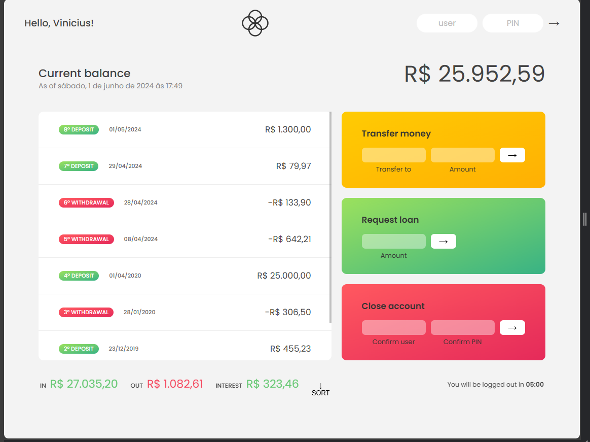

*Imagem do projeto (clique para expandí-la!)*  


# Nome do Projeto

### Bankist 
É uma simulação de conta bancária e suas transações - transferência, empréstimo e cancelamento.

## 🔥 Introdução

Coloque aqui as instruções e quais são os objetivos desse projeto, funcionalidades.

### ⚙️ Link para acessar o projeto

https://yourdigitalbank.netlify.app

```
Pode inserir exemplos.
```

## 📦 Tecnologias usadas:

Coloque aqui as ferramentas que você usou para criar seu projeto, exemplo:

* 
* 
* 

- Link para pegar as badges: https://github.com/Ileriayo/markdown-badges

Ou pode separar por stacks:

**Front-end:**
* [React JS](https://react.dev/)
* 

## 👷 Autores

Mencione todos aqueles que ajudaram a levantar o projeto desde o seu início, colaboradores.

* **Nome do dev** - *Função realizada* - [nome_do_dev](https://github.com/link_do_Perfil)
* **Sujeito Programador** - *Frontend do projeto* - [@sujeitoprogramador](https://github.com/devfraga)

## 📄 Licença

Esse projeto está sob a licença (nome da licença) - acesse os detalhes [LICENSE.md](https://github.com/link_da_licenca).

## 💡 Expressões de gratidão

* Um agradecimento publicamente.
* Para suporte, mande um email para vmm_7@hotmail.com
* [Meu linkedin](https://www.linkedin.com/in/vinmm/)
